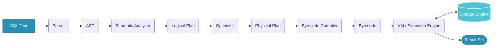
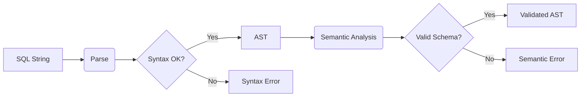
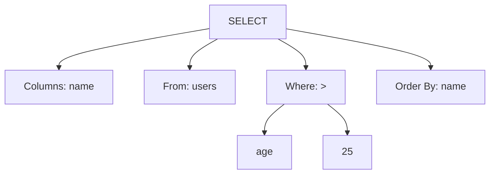
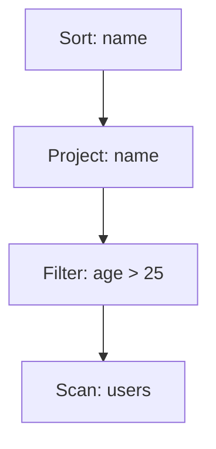

---
layout: statement
---

# Query Processing in Databases
From SQL Statement to Data Retrieval

---
layout: default
---

# 1. What is Query Processing?

**Query processing** is the process of transforming a high-level, declarative query (like SQL) into a sequence of low-level operations that retrieve or manipulate the actual data on disk.

* **Declarative vs. Imperative**: 
  * SQL tells the database **what** you want (the declarative promise).
  * Query processing is the entire **how** layer (the imperative execution steps).
* **The "Why Should I Care" Hook**:
  * The *exact same* SQL query can be executed in multiple ways under the hood.
  * Depending on the chosen execution plan, performance can vary by **orders of magnitude** (milliseconds vs. hours).
  * Understanding query processing is key to writing scalable database applications.

---
layout: center
---

# 2. Query Processing Pipeline



<div class="text-center mt-4 text-sm opacity-80">
Linear flow from declarative text to physical disk operations.
</div>

---
layout: two-cols
---

# Parsing & Semantic Analysis

### Parsing
* **Input**: SQL text.
* **Output**: Parse tree / Abstract Syntax Tree (AST).
* **Function**: Validates SQL grammar. Rejects queries with syntax errors (e.g., misspelled keywords) before doing any real work.

::right::

### Semantic Analysis (Validation)
* **Input**: AST.
* **Function**: Checks the AST against the schema metadata.
  * *Do the referenced tables/columns exist?*
  * *Are data types compatible?*
  * *Is the query semantically valid?*


<br><br><br>

---
---



---
layout: default
---

# Query Rewrite & Logical Plan Generation

The validated AST is converted into a **Logical Query Plan**—an abstract representation of relational operations (selection, projection, join, aggregation) *without* specifying how each will be executed.

### Query Rewrite Rules
The database applies heuristic rules to simplify and optimize the logical plan mathematically:
* **Predicate Pushdown**: Moving filters (e.g., `WHERE` conditions) as close to the data source as possible to reduce intermediate dataset sizes.
* **View Expansion**: Replacing view references with their underlying queries.
* **Subquery Flattening**: Converting nested subqueries into computationally cheaper standard JOINs.

---
layout: default
---

# Query Optimization (Logical → Physical)

The **Query Optimizer** explores possible physical execution strategies (e.g., which join algorithm to use, which index to scan, join ordering) and picks the best one.

* **Cost-Based Optimization (CBO)**: 
  * Generates multiple candidate physical plans.
  * Estimates the "cost" of each plan (CPU, memory, disk I/O).
  * Uses statistics like **table cardinality**, **index selectivity**, and **data histograms**.
* **The "Brain" of the Database**: 
  * This is the most complex stage. 
  * Deciding between a Full Table Scan vs. an Index Seek depends heavily on the statistics (e.g., estimating if a filter matches 1% or 90% of the rows).

---
---

# VM Execution Engine & Bytecode

Many modern databases (like **SQLite**) don't interpret physical plans directly. They compile them into a sequence of **bytecode instructions**.

* **Why Bytecode?**
  * **Separation of Concerns**: Decouples query planning from execution.
  * **Efficiency**: The VM is a highly optimized state machine that executes instructions one at a time.
  * **Prepared Statements**: Compile the plan once into bytecode, then execute it many times with different parameters, skipping the expensive optimization phase entirely.


---
---

# Storage Engine Access

The bytecode instructions eventually call down into the **Storage Engine** to perform actual data retrieval against disk structures (e.g., **B-Tree** or **LSM tree**).

* **Example Operations**: 
  * "Open a cursor on this B-tree index"
  * "Seek to this key"
  * "Read next row"
* **Result Assembly**: Fetched rows are assembled, filtered, projected, sorted, and aggregated as required, before returning to the client.

---
layout: center
---

# 3. Full End-to-End Example

Let's trace a concrete query through every single stage.

<div class="p-4 bg-gray-100 dark:bg-gray-800 rounded-md shadow-md text-xl font-mono text-center my-8">
SELECT name FROM users WHERE age > 25 ORDER BY name;
</div>

**Context:**
* We are querying a `users` table.
* There is a B-Tree index on the `age` column.

---
layout: two-cols
---

# Stage 1 & 2: AST & Logical Plan

**Parsed AST (Simplified)**


::right::

<br>

**Logical Plan**

*(Abstract relational algebra, no physical execution details yet)*

---
layout: default
---

# Stage 3: Physical Plan Selection

The optimizer considers multiple physical plans.

* **Plan A: Full Table Scan**
  * Read every row in the `users` table from disk.
  * Filter rows where `age > 25`.
  * Extract `name` and sort.
* **Plan B: Index Seek**
  * Traverse the `age` index to find keys `> 25`.
  * For each matching index entry, fetch the full row from the main table.
  * Extract `name` and sort.

**Cost-Based Reasoning:**
If the optimizer estimates that `age > 25` has **high selectivity** (e.g., matches only 2% of the table), it picks **Plan B**. If it estimates it matches 95%, it picks **Plan A** (since sequential disk I/O is faster than many random row lookups). 
*(We assume it picks Plan B)*.

---
layout: default
---

<QueryOptimizerSimulator />


---
layout: default
---

# Stage 4: Bytecode Instructions

The physical plan is compiled into an illustrative bytecode sequence (modeled conceptually after SQLite's Virtual Database Engine):

```text {all|1-2|3|4-6|7|8|9-10|all}
1: OpenRead    0  (users table)
2: OpenRead    1  (age_index)
3: SeekGT      1  25             // Traverse index to first key > 25; jump to 9 if none
4: RowKey      1  register_id    // Extract primary key from index entry
5: SeekRow     0  register_id    // Look up the full row in the main table
6: Column      0  "name"         // Extract the 'name' column
7: SorterInsert                  // Push the name into an in-memory sort buffer
8: Next        1  3              // Move to the next index entry, loop back to line 3
9: Sort                           // Perform the actual sort operation
10: ResultRow                     // Yield the final sorted rows to the client
```

*This transforms the declarative SQL into a precise imperative program.*

---
layout: default
---

# Stage 5: Storage Engine Execution

How the bytecode maps to actual data structure operations:

* **`SeekGT`**: Traverses the B-tree index from the root node down to the leaf node containing the first value greater than 25.
* **`Next`**: Moves to the next entry. Because B-tree leaf nodes form a linked list, this is an incredibly fast, $O(1)$ sequential pointer jump.
* *(Contrast with LSM Trees)*: If this storage engine used an LSM tree, `SeekGT` would involve checking an in-memory memtable and setting up iterators across multiple on-disk SSTable levels, merging the results to find the globally "next" value.

**The Payoff**: The exact same SQL query gets executed as precise B-tree pointer hops rather than a naive multi-gigabyte disk scan.

---
layout: default
---

# 4. Conclusion

* **The Journey**: SQL is simply a promise about *what* you want. Query processing is the multi-stage machinery (parsing → planning → optimizing → compiling → executing) that turns that promise into actual disk operations.
* **The Optimizer is King**: The quality of a database's query optimizer is often *more* impactful to real-world performance than the raw speed of its storage engine. A bad plan (e.g., full table scan on a huge table) can be orders of magnitude slower regardless of hardware.
* **Practical Application**: This is exactly why you should understand `EXPLAIN` and `EXPLAIN ANALYZE` commands in your database! They show you the chosen **physical plan**—your direct hook into understanding what the query processor actually did with your SQL.

---
layout: center
class: text-center
---

# Thank You
## Questions?
